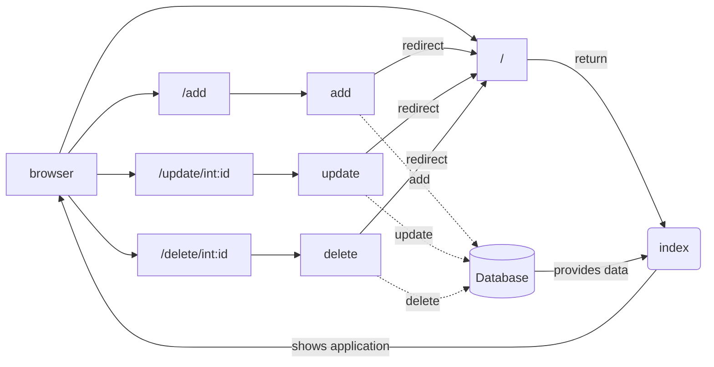

I was learning to work with Flask, SQLAlchemy and WTForms and Login Manager. So 
I created this simple auth app as reference to my future self and starting point 
for new apps. This example can be easily expanded to add new functions.

# Setting up initial install

Let's start by cloning this repo:

```bash
$ git clone https://github.com/KingOfSpades/...
$ cd pythonFlaskUserAndAuthExample
```

As always you should start with an empty `venv`, activate it and install the 
required dependancys:

```bash
$ python3 -m venv .venv
$ source .venv/bin/activate
$ pip install -r requirements.txt
```

Now start the app with `make` or run it manually:

```bash
$ make run
```

This will start the app on: http://127.0.0.1:5000. You should now see this 
beautifull todo app:


# Explaining the app

This is easy app tha relies on one (1) database model, a FlaskForm and four (4)
routes to handle requests:


## Diagram overview



## Forms

